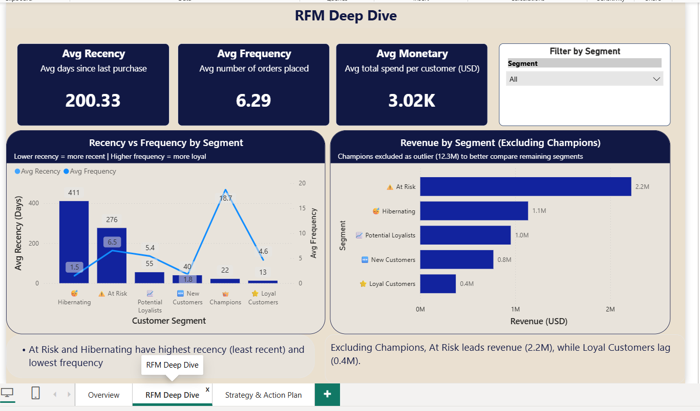

# 🛒 Customer Segmentation Dashboard — RFM Analysis & K-Means Clustering


## 📌 Project Overview

This project segments **5,878 customers** from a real UK-based online retail 
business using **RFM Analysis** (Recency, Frequency, Monetary) combined with 
**K-Means Clustering**. The goal is to identify distinct customer groups and 
recommend targeted business strategies for each segment.

The final output is a **3-page interactive Power BI dashboard** that allows 
stakeholders to explore customer behavior, compare segments, and plan marketing 
actions.

> 💡 **What is RFM Analysis?** RFM stands for Recency (how recently a customer 
> bought), Frequency (how often they buy), and Monetary (how much they spend). 
> It is one of the most widely used customer segmentation techniques in business.

---

## 🎯 Business Questions Answered

| # | Question |
|---|---|
| 1 | Who are our most valuable customers? |
| 2 | Which customers are at risk of churning? |
| 3 | How do different segments behave in spending and frequency? |
| 4 | What marketing action should we take for each segment? |

---

## 🔑 Key Findings

| Segment | Customers | Avg Spend | Avg Recency | Insight |
|---|---|---|---|---|
| 🏆 **Champions** | 1,182 | $10,397 | 22 days | Highest value, most recent buyers |
| ⚠️ **At Risk** | 880 | $2,525 | 276 days | High value but losing engagement |
| 💤 **Hibernating** | 2,045 | $555 | 411 days | Largest group, needs re-engagement |
| 🌱 **Potential Loyalists** | 540 | $1,764 | 55 days | Recent buyers with growth potential |
| 🆕 **New Customers** | 894 | $861 | 40 days | Recently acquired, low frequency |
| ❤️ **Loyal Customers** | 337 | $1,111 | 13 days | Frequent buyers, lower spend |

> 💡 **Key Insight:** Champions represent only **20% of customers** but drive the 
> **majority of revenue**. Hibernating customers are the largest segment (34%) 
> and represent the biggest re-engagement opportunity.

---

## 🎯 Recommended Actions by Segment

| Segment | Recommended Action |
|---|---|
| 🏆 Champions | Reward with loyalty program and early access offers |
| ⚠️ At Risk | Send win-back email campaign with special discount |
| 💤 Hibernating | Offer strong discount to re-engage (30%+ off) |
| 🌱 Potential Loyalists | Upsell with targeted personalized offers |
| 🆕 New Customers | Launch onboarding email campaign |
| ❤️ Loyal Customers | Maintain with regular communication and rewards |

---

## 🖥️ Dashboard Pages

### Page 1 — RFM Overview


### Page 2 — RFM Deep Dive


### Page 3 — Segment Strategy and Action Plan


---

## 🔬 Methodology

### Step 1 — Data Cleaning
- Removed duplicates and null values
- Filtered out cancelled transactions
- Removed negative quantities and zero prices
- Exported cleaned dataset for RFM analysis

### Step 2 — RFM Analysis
- Calculated Recency, Frequency, Monetary values per customer
- Scored each dimension on a 1-5 scale
- Combined scores into RFM segments with business labels

### Step 3 — K-Means Clustering
- Scaled RFM features using StandardScaler
- Used **Elbow Method** to determine optimal k=4
- Applied K-Means clustering and validated with cluster profiles
- Visualized clusters using Radar chart and 3D scatter plot

### Step 4 — SQL Analysis
- Ran 5 business queries using SQLite
- Queries cover: segment performance, customer tiers, recency status, top customers, cluster analysis

### Step 5 — Power BI Dashboard
- Built 3-page interactive dashboard
- Page 1: RFM Overview — KPI cards, donut chart, revenue bar chart
- Page 2: RFM Deep Dive — combo chart, segment revenue comparison
- Page 3: Segment Strategy — avg monetary chart, summary table, recommendations

---

## 📊 Dataset

| Field | Detail |
|---|---|
| **Name** | Online Retail II |
| **Source** | UCI Machine Learning Repository / Kaggle |
| **Type** | E-commerce transactions |
| **Period** | December 2009 – December 2011 |
| **Original Size** | 1,067,371 transactions across 40+ countries |
| **After Cleaning** | 5,878 unique customers |

> ⚠️ **Note:** The raw data file is not included due to its large size (90MB).
> Download from Kaggle: [Online Retail II Dataset](https://www.kaggle.com/datasets/mashlyn/online-retail-ii-uci)
> Place it in the `data/` folder as `raw_data.csv` before running the notebooks.

---

## 📁 Project Structure

customer-segmentation-dashboard/

│

├── 📂 data/

│   └── customer_segmentation_cleaned.csv

│

├── 📂 notebooks/

│   ├── customer_segmentation_analysis.ipynb

│   └── sql_queries.ipynb

│

├── 📂 Dashboard/

│   └── customer_segmentation.pbix

│

├── 📂 Screenshots/

│   ├── page1_overview.png

│   ├── page2_rfm_deep_dive.png

│   └── page3_strategy.png

│

├── 📂 sql_results/

│   ├── 01_segment_performance.csv

│   ├── 02_customer_tiers.csv

│   ├── 03_recency_status.csv

│   ├── 04_top_customers.csv

│   └── 05_cluster_analysis.csv

│

└── README.md

---

## 🛠️ Tools & Technologies

| Tool | Purpose |
|---|---|
| **Python 3** | Data cleaning, RFM analysis, clustering |
| **Pandas** | Data manipulation |
| **Scikit-learn** | K-Means clustering, StandardScaler |
| **Matplotlib / Seaborn** | Visualizations in notebooks |
| **SQLite** | SQL business queries |
| **Power BI** | 3-page interactive dashboard |
| **Google Colab** | Cloud-based notebook environment |

---

## 🚀 How to Run

```bash
# Step 1: Clone the repository
git clone https://github.com/Hashimkhan303/customer-segmentation-dashboard

# Step 2: Download raw data from Kaggle
# Place in data/ folder as raw_data.csv

# Step 3: Install required libraries
pip install pandas scikit-learn matplotlib seaborn

# Step 4: Run the notebooks in order
jupyter notebook notebooks/customer_segmentation_analysis.ipynb
```

### Power BI Dashboard
1. Download `Dashboard/customer_segmentation.pbix`
2. Open in **Power BI Desktop** (free from Microsoft)
3. Refresh data source if prompted
4. All 3 pages will load automatically

---

## 👨‍💻 Author

**Hashim Khan**

- 🐙 GitHub: [Hashimkhan303](https://github.com/Hashimkhan303)
- 💼 LinkedIn: ([paste your LinkedIn URL here](https://www.linkedin.com/in/hashim-khan-96b5082b4/))
- 🎓 Google Data Analytics Certificate
- 🎓 Google Advanced Data Analytics Certificate

---

## 📄 License

This project uses publicly available data from the UCI Machine Learning Repository.
Built for educational and portfolio purposes only.

---

⭐ **If you found this project useful, please give it a star!**
